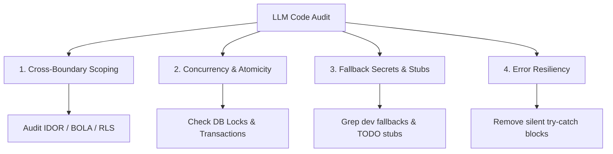

# LLM Codebase Security & Audit Guide: Overlooked Vulnerabilities & Heuristic Flaws

This guide outlines what AI models (Claude, Codex, GPT-4o, etc.) frequently **overlook during code reviews** and the **typical heuristic issues** found in codebases *generated* by LLMs.

---

## 1. What LLMs Overlook During Security Reviews

| Category | Overlooked Issue | Why LLMs Miss It |
| :--- | :--- | :--- |
| **Cross-File Logic & Context** | Inter-procedural vulnerabilities & state corruption across modules/workers | LLMs evaluate files or snippets in isolation, missing global state mutability and broken contract assumptions across files. |
| **Authorization (BOLA/IDOR)** | Broken Object-Level Authorization & Property Scoping (BOLA/BOPLA) | Syntax checks pass because `user` context exists; LLMs miss missing scope validation (e.g., missing `tenant_id` or `owner_id` in SQL `WHERE` clause). |
| **Concurrency & Race Conditions** | Time-of-Check to Time-of-Use (TOCTOU), non-atomic DB updates, worker races | LLMs analyze static logic flows but cannot simulate asynchronous runtime interleaving or event loop race conditions. |
| **Business Logic Flaws** | Workflow bypasses, double-spending, boundary condition exploits | OWASP syntax patterns look clean; LLMs lack domain knowledge of expected multi-step business constraints. |
| **Cryptographic Misconfigurations** | Weak nonces/IV reuse, low PBKDF2 iterations, JWT `alg: none` / key confusion | Code calls valid crypto methods; LLMs assume correct parameters without evaluating key management lifecycle. |
| **Configuration Drift & Middleware** | Exposed admin routes, weak CORS (`*`), missing rate limiting, lax CSP | Focus is on application code rather than infrastructure, edge middleware, header flags, or proxy rules. |

---

## 2. Typical Heuristic Bugs in LLM-Built Codebases

| Heuristic Flaw | Manifestation & Impact |
| :--- | :--- |
| **Silent Exception Swallowing** | Generic `try { ... } catch (e) { return []; }` masks failures, leading to silent data corruption downstream. |
| **Happy-Path Bias & Unchecked Nulls** | Missing null checks on nested properties (`res.data.items[0].id`), causing unhandled crashes on unexpected payloads. |
| **Frankenstein Architecture** | Inconsistent patterns across files (e.g., mixing REST + RPC, raw SQL + ORM, conflicting JWT payload structures). |
| **Hallucinated / Stale API Signatures** | Blending deprecated library methods (e.g., Next.js 12 vs 14, Supabase v1 vs v2) or non-existent parameter flags. |
| **Fallback Secrets & Mock Residuals** | Hardcoded fallbacks (`const secret = process.env.JWT_SECRET || "dev-secret-123"` or `req.user?.id || "admin"`). |
| **Stubbed Functions & Partial Logic** | Complex abstract classes/interfaces containing empty `// TODO: Implement` stubs that bypass security silently. |
| **N+1 Database Queries & In-Memory Pagination** | Fetching entire tables into memory to filter/sort, missing indexing, executing database queries inside tight loops. |

---

## 3. Audit Checklist: What to Look At

### Step 1: Authorization & Multi-Tenancy (BOLA/IDOR)
- [ ] Verify **every** database query checks resource ownership (`owner_id`, `tenant_id`, or RLS policy).
- [ ] Inspect mass-assignment / object mutation endpoints to prevent privilege escalation (BOPLA).
- [ ] Audit unauthenticated API routes and public webhook handlers for secret verification (e.g., HMAC signatures).

### Step 2: State Machine & Concurrency Integrity
- [ ] Check balance/inventory updates for atomic transactions (`SELECT FOR UPDATE`, ACID locks, or atomic increments).
- [ ] Review background jobs and event queues for idempotent processing and race conditions.
- [ ] Audit multi-step workflows (e.g., checkout, password reset) for mandatory state validation at each step.

### Step 3: Error Handling & Resilience
- [ ] Search for silent failovers (`catch`, `except: pass`, empty return objects).
- [ ] Ensure sensitive internal stack traces, DB schemas, or API keys are not returned in error responses.
- [ ] Validate edge case behavior for `null`, `undefined`, empty strings, negative numbers, and boundary values.

### Step 4: Environment Secrets & Fallbacks
- [ ] Grep for inline fallback secrets, dev credentials, and hardcoded JWT keys.
- [ ] Verify environment variables fail fast on application launch if missing (schema-validated env files).

### Step 5: Dependency & API Signature Audit
- [ ] Scan for hallucinated or typosquatted package imports in package manifests.
- [ ] Validate third-party API call signatures against current vendor documentation.
- [ ] Run AST static analysis and dynamic tests to detect unhandled async rejections.

---

## 4. Summary Action Plan

---
*Location: `docs/LLM_CODEBASE_AUDIT_GUIDE.md`*
